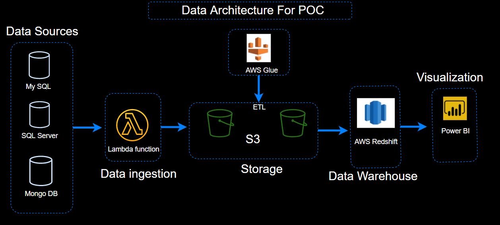
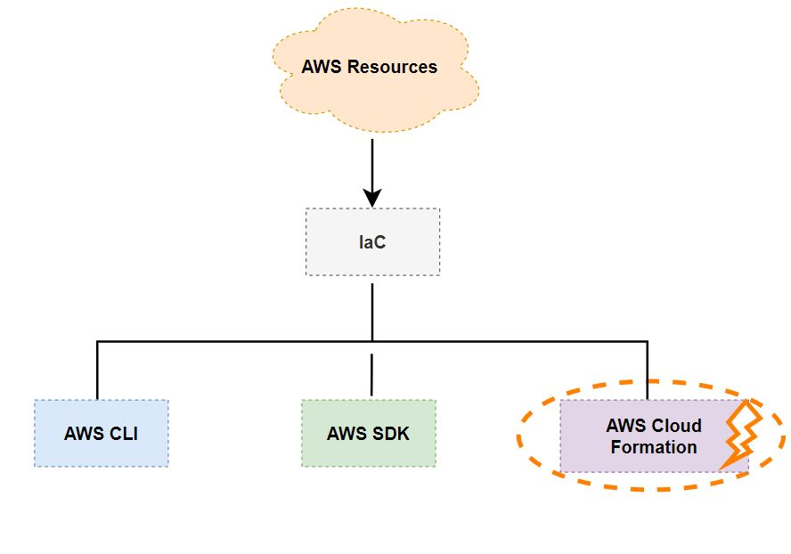
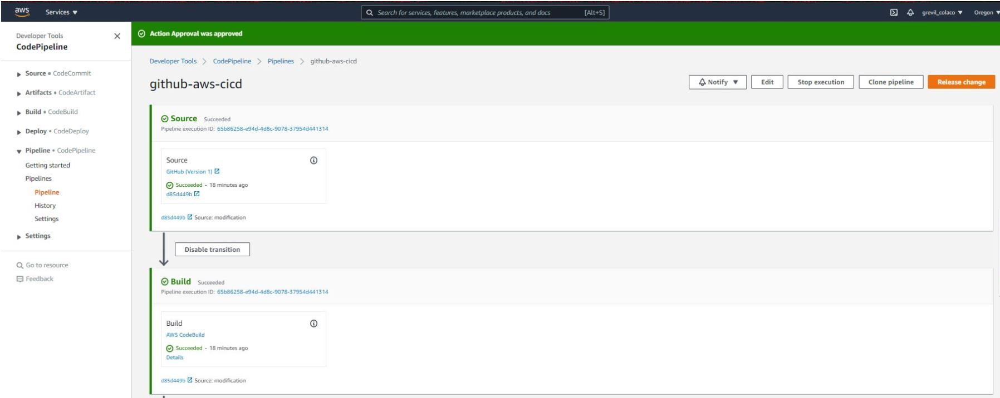
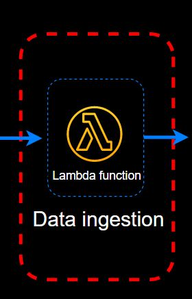
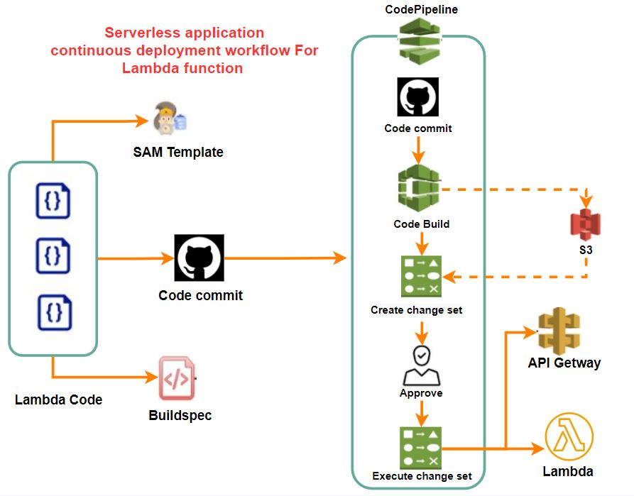
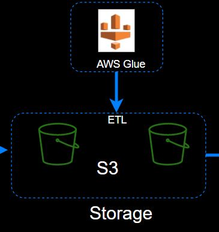
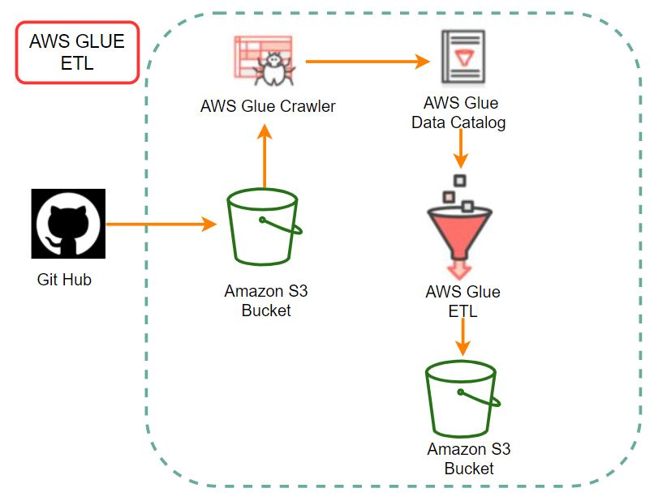
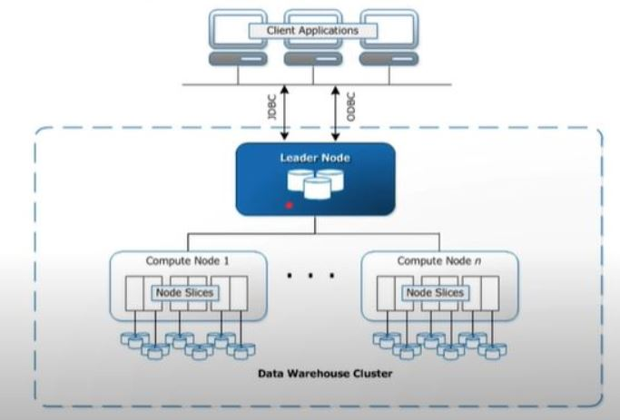

# Proof Of Concept File Deliverable
The Required deliverables for this assessment are provided below. 

# Assumptions For POC
- Cloud of choice is AWS.
- Iac method implemented for various AWS resources is cloud formation.
- Code Editor used is Visual Studio Code.
- Version control tool used was a git.
- Assuming that the structured and unstructured data in an on-premise comes from Database management systems or data sources like My SQL, Microsoft SQL Server, Mongo DB.
- Assuming AWS Lambda function as a data ingestion resource.
- Assuming AWS glue is used for ETL and S3 bucket for storage.
- Assuming AWS redshift to be used for data warehousing.
-  Assuming BI application like Power BI is used for the Analytics process. 
- Assuming we have a batch or historical data.

# Data Architecture Diagram for POC
- Based on the above assumptions, `Data Architecture Diagram for POC` was constructed and the diagram is shown below.
- The Data Architecture below is constructed by keeping in mind the customer requirements for the proof of concept.

- The above architecture was selected keeping in mind the data sources provided by the customer for POC.
- To extract data from different data sources `lambda` function was chosen, because it has can seamlessly and asynchronously extract data and can ingest the data into the data lake(Storage)
- - Why `lambda function?` because it a serverless solution/application and there is no need to maintain a server.
- - It also has the benefit of pay when you use it. 
- For data storage `Amazon S3` is used because it is highly available and cost-efficient. 
- In the storage stage we need to store the raw data in one bucket to store it in case of pipeline failure.
- We also need to transform and enrich the data as per the customer requirement mentioned in the POC.
- Assuming huge loads of data and assuming large time and memory requirements for data processing `AWS Glue` is used for the ETL and data normalization process.   

# Infrastructure As Code (IaC)
- Infrastructure as code is an important technique used by modern Data Engineers. 
- The advantage of being on the cloud is that its ability to create infrastructure i.e, machines, users, roles, folders, and processes using code.
- IaC lets one automate, maintain, deploy, replicate, and share complex infrastructure as you maintain a code.
- We have several options to achieve IaC on AWS.
 - - AWS CLI
   - AWS SDK
   - `AWS Cloud Formation`

- For this POC AWS Cloud Formation was used as Infrastructure as code.

# Steps for building CI/CD pipeline using AWS Cloud Formation Platform Example:
## Step 1 Generating Personal Access Token in Github
* The personal authentication token is generated to access Github API.
* We will be creating webhooks in the repository, hence we need to select the `repo` and `admin: repo_hook` for permission.
* Remember to save the token to the AWS secret manager right away.
## Step 2 Add token to AWS Secret Manager
* In AWS secret manager, store a new secrete.
* Paste the token give it a name and proceed.
* This secrete can be used in the AWS Cloud Formation template or `AWS SDK` the sample codes are available.
## Step 3 Creating a New Github Repo
* Create a new GitHub repo and copy the URL.
* In git bash run the `$ git clone command
* Make sure you can see the same files as in the GitHub repo.
## Step 4 Creating a `.YAML` file (Buildspec Template)
* In AWS build specification reference for CodeBuild you can find a reference example.
*  Find the example code and past it in any editor, in my case visual code studio.
* Save the file and upload the file to GitHub using the command `git add` and then `git commit -am "build file added"`.
* You can check the commit using `git log`.
Once the commit is made run the command `git push origin master` to push the files to the master branch on GitHub. 
* You should see the files in the Github repo by now.
## Step 5 Creating a cloud formation template to create codebuild project which runs buildspec.yaml
* In the AWS service console navigate to AWS Cloud formation and create a stack and create a template in a designer.
* For this process, a YAML file was used. In resource, type search for codebuild and use that template. 
* - Give the project a name.
- - Also you need to define ServiceRole: `IAM role`.
- -  To know which all properties are required to define cloudformation template please check the cloudformation documentation and check the required parameters. 
- - define assume role policies. 
- - Next is to define `Source and the artifacts` where we specify Github location the repo `URL and authentication.
- - Next, define the `CodeBuildCredentials` and provide the server type i.e Github and the Access Token.
- - Now validate the project and check if there are any errors.
- - next step is to define the environment and provide a container image. You can find this in the documentation on the Docker image provided for AWS codebuild. 
- - Copy the .yaml template and create a new file, in my case I created a `pipeline. yaml` file in Visual studio code.
- - paste the template in the `pipeline.yaml` file in Visual studio code 
- - After copying the file create the stack AWS cloudformation. 
- - Create a develop branch on GitHub using the command `$ git checkout -b develop`.
- - Check the status using `$ git status` and you will see the files that need to be committed to the Github repo.
- - To commit the file use command `$ git commit -am "type a commit message"`.  On Github, we need to create a pull request. Next, we need to squash and merge so the pull request will be closed and our process is validated. 
- - We also need to provide branch protection rules on GitHub so that pull requests cannot be merged unless the codebuild project is successfully completed. 
- - Next, we can checkout the master using the command `$ git checkout master` and then use the command `$ git pull`. 
- - You can also check the log history using the `$ git log` command.
- - We also need to provide an owner and the Github repo name in .yaml file parameters. 
- - Make sure to also save the changes to the .yaml file in AWS cloudformation template. 
- - Again save these changes using the `$ git commit -am "type a commit message"` command.
- - After this, we need to push the files to our Github repo using the command `$ git push origin develop --force`. Here we use -- force flag as the commit does not match and doing so does a force update. 

## Step 6 Creating the Code Pipeline
- -  Create a resource for code pipeline in AWS cloud formation template.
- - Change the service role to `CodePipelineServiceRole`.
- - Provide `S3 bucket` in artifact store.
- - Create the S3 bucket resource. 
- - Then provide the stages and also provide the access token. 
- - Validate the .yaml template and update the stack. 
- - Once the stack is updated we can check the code pipeline in the AWS code pipeline. 
- -  In my case, the pipeline was successfully created and can be seen in the figure below. 

 

- - Next, we need to commit the changes in the pipeline.yaml file and update the changes on the GITHUB repo. 
- - For this, we can pull the files from GITHUB master and then update and file and then Push the files back to develop branch using the git commands mentioned above, and then we can squash and merge.
## Step 7 Creating deployspec. yaml file
- - Over here we can create a depelspec.yaml file in visual studio code. 
- - We also need to add a new stage in codebuild pipeline with the name dev and action name as Deploy. Modify the files and validate the stack. After validation also updates the GITHUB Repository. 
- - Check if something needs to be committed by checking the status and then use git commit to commit changes.  Once the commit is done finally update the repo using the git push command. 
- `A similar process was used to create a pipeline for Lambda function with the steps mention below.
- `The example CI/CD code pipeline example mentioned above is just a basic example, and we can we a similar process to deploy other AWS resources using AWS Cloud Formation as an IaC`.  

 # Serverless Application Continuous Deployment Workflow With Cloud Formation for building Lambda Function Architecture
 - For the Data ingestion process in the `Data Architecture Diagram` as shown in the figure below lambda function data pipeline needs to be created.
 

 - The Process flow diagram below shows the process used to build Serverless Application Continuous Deployment Workflow With Cloud Formation.

## The Steps followed in creating a lambda function are:

### 1 Create A Service Role: 
#### `Cloudformation service role`
- - S3
  - Cloud pipeline
  - lambda function
  - API getway
  - Cloudformtion

### 2 Application Setup:
#### `SAM Template`
- - Sam Template.yaml
#### `Code Buildspec`
- - Buildspec.yaml

### 3 Create Pipeline:
#### `Code Pipeline stages`
- - Source
  - Build
  - Create change set
  - Approve change set
  - Execute Change set 

# The Steps followed in creating AWS Glue ETL Process Architecture
- In order to transform and normalize the raw data ingested from the lambda function tool, `AWS Glue` an ETL tool is implemented in the storage phase of theData Architecture`
as shown below.

- To elaborate on the AWS Glue ETL process, a more detailed diagram is depicted below.

- AWS Glue is a fully managed serverless ETL service for developers.
- Some advantages if AWS Glue
- - Job authoring: Auto-generates ETL code in Python Apache spark
- - Job execution: serverless execution and flexible scheduling.
- The transformed and normalized data from AWS Glue can then be sent to the Redshift data warehouse and then for analytical processes. 

# AWS Redshift Datawarehouse Architecture
- - Redshift provides Massively Parallel Processing (MPP)
of databases by parallel execution of one query on multiple CPUs.
- - A Redshift cluster consists of n-slices(CPU) and these slices can process n-partition of tables simultaneously.
- - The figure below shows Amazon Redshift architecture:

   

# Some Important Commands Implemented in Version/Source  Control management tool(Git)
- First, create a directory using the command `mkdir` on your local machine and then run the command `$ git inti`, this creates your working directory into Github repo.
- To add made changes to git repo use the` $ git add .` command
- Then commit changes using `$ git commit -am "message during commit"`. 
- Now create a Repo on Github give it a name in my case it's called `aws-cicd-project-Grevil`. 
- Copy the URL from the repo and in the terminal use command `$ git remote add origin https://` followed by the URL. 
- This will link our local directory to the Github repo. 
- Finally, we need to push the files from the local machine to our Github repo using the command `$ git push --set--upstream origin master`.
- You will see new files uploaded to the Github repo.
- Finally, some important `$ git` commands:
 - -  `$ git add .`
 - -  `$ git commit -am "type a message"`
 - -  `$ git push origin master` 
 - -  `$ git pull origin master`
 - -  `$ git checkout master`
 - -  `$ git log`
 - -  `$ git status`
 - -  `$ git push --set-upstream origin develop`
 - -  `$ git init `
 - -  `$ git push origin develop --force `

 ### Finally my last say: `There is no right tool or wrong tool in this process, it always depends on your/customer needs`.

